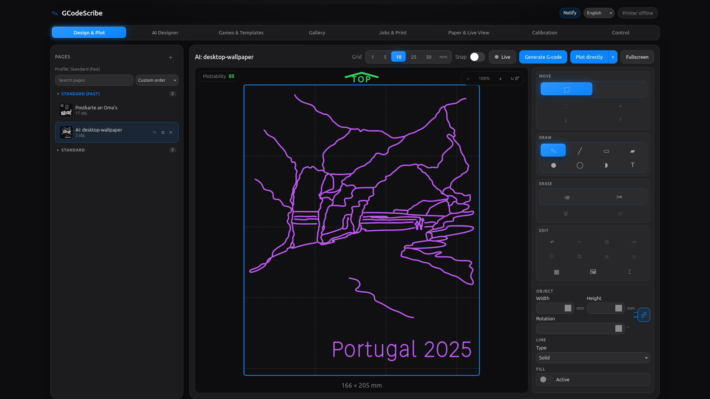
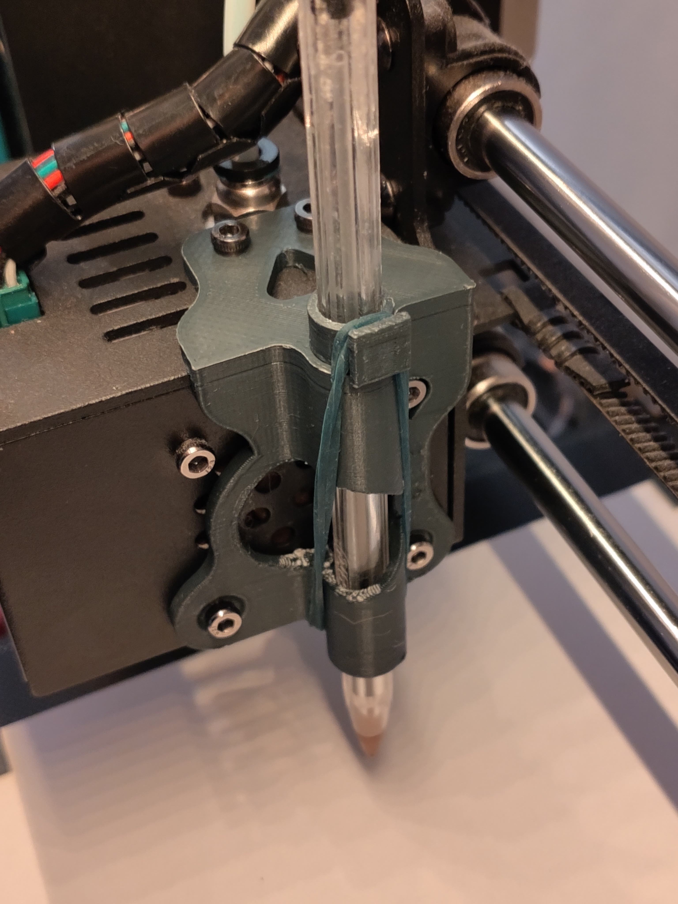
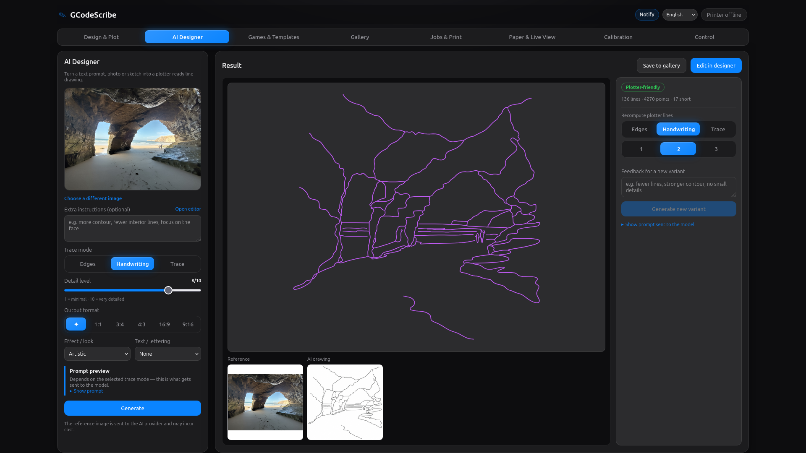
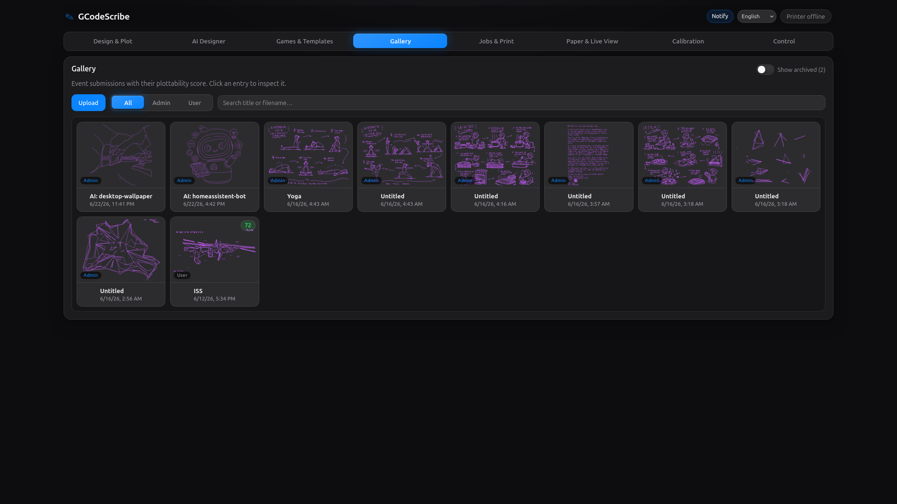
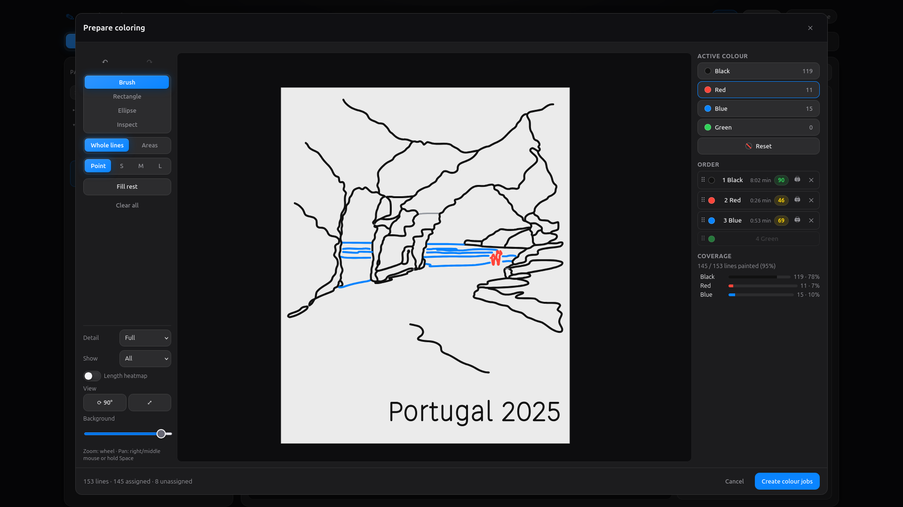
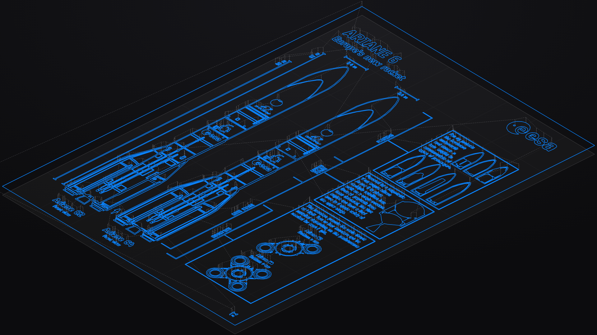

# GCodeScribe

A browser-based pen-plotter studio for turning PDF, SVG, image, and Office
documents — plus generated templates, maps, Markdown layouts, and optional
AI-assisted artwork — into safe G-code for an **Anycubic i3 Mega S**, any
OctoPrint-backed printer, or a direct USB-serial Marlin setup.

<table>
  <tr>
    <td width="70%"></td>
    <td width="30%"></td>
  </tr>
</table>

GCodeScribe combines document conversion, an interactive designer, an asset
gallery, AI image redrawing, OpenStreetMap plotting, browser-side generators,
live paper calibration, G-code preview, and printer control in one small web
app. Bring in an existing file or generate something new, place it on the
virtual bed, preview the mapped toolpaths, and send it to the printer from the
same interface.

## Highlights

<table>
  <tr>
    <td width="50%"></td>
    <td width="50%"></td>
  </tr>
  <tr>
    <td align="center"><strong>AI Designer</strong></td>
    <td align="center"><strong>Gallery Asset Library</strong></td>
  </tr>
  <tr>
    <td width="50%"></td>
    <td width="50%"></td>
  </tr>
  <tr>
    <td align="center"><strong>Coloring Editor</strong></td>
    <td align="center"><strong>G-code Preview</strong></td>
  </tr>
</table>

## Features

### Convert, generate & remix

- Convert PDF, SVG, raster images, and Office documents into plotter-ready
  G-code with [vpype](https://vpype.readthedocs.io).
- Trace image-only PDFs and scans with OpenCV while preserving vector paths
  from vector PDFs. Auto mode chooses the best conversion path automatically.
- Generate printable artwork directly in the browser — no source file needed:
  - **Puzzles:** mazes (classic, masked, hex, polar) and sudoku.
  - **Games:** dots &amp; boxes, tic-tac-toe, meta tic-tac-toe, connect four,
    battleships, bingo, and city/country/river sheets.
  - **Coloring pages:** mandalas and geometric pattern generators.
  - **Maps:** select a live OpenStreetMap viewport, choose streets, paths,
    buildings, waterways, water, rail, or transit layers, and turn the result
    into plotter-ready vector linework.
- Use the optional **AI Designer** to turn a text prompt, photo, or sketch into
  plotter-ready black-on-white line art. Tune trace mode, detail, aspect
  ratio, effect, and lettering; create feedback-driven variants; and re-render
  plotter lines without another provider call.
- Keep every upload and generated design in the **gallery** — the one asset
  library for images, SVG, and multi-page PDF/Office documents (admin and public
  `/upload` submissions, filterable by origin) — with thumbnails, titles,
  archiving, plottability scores, and one-click reuse or insertion into the
  designer.

### Design, score & color

- Place documents visually in the **Design &amp; Plot** tab: upload to the
  gallery, insert any page onto the bed preview, then drag, rotate, scale,
  center, and fit artwork into the calibrated plot area — or quick-plot a page
  in two clicks.
- Draw from scratch on the paint canvas: place shapes and text, scale and
  arrange them, cover lower lines with mask rectangles, pan/zoom/rotate the
  canvas view, and turn the result into a plot job.
- Lay out plot-friendly notes, cards, and worksheets with the built-in
  Markdown editor, then insert them as vector text into the designer.
- See plottability feedback before printing: gallery items, AI outputs, and
  paint pages are scored so overly slow, tiny, or fragmented drawings stand
  out early.
- Use the **Coloring Editor** to assign linework to multiple pen colors and
  generate separate G-code jobs per color for pen-swap workflows.

### Calibrate &amp; plot safely

- Calibrate pen-up and pen-down Z heights, plot area, origin offsets, margins,
  and feedrates from the browser.
- Use the live paper calibration wizard to home the machine, jog to sheet
  corners, capture paper bounds, and map every conversion onto the real sheet.
- Manage multiple calibration profiles (e.g. "A4 portrait", "postcard front
  left", "thick paper"): create, duplicate, activate, archive, and im-/export
  them as JSON — single profiles or a full bundle. Existing installations are
  migrated into a default profile automatically.
- Every generated job and paint page is bound to the profile it was created
  with (id + fingerprint over all safety-relevant values). The backend refuses
  to send a job whose profile does not exactly match the active one — foreign,
  changed (stale), archived, deleted, or pre-profile legacy jobs stay visible
  but are not printable until regenerated or explicitly adopted.
- Enforce safety checks before saving or printing: generated jobs never contain
  `G28`, Z moves are limited to calibrated pen heights, and drawing moves must
  stay inside the configured plot area.
- Export calibration as XML and embed calibration metadata in every generated
  G-code job.

### Preview &amp; control

- Preview generated G-code against the bed and calibrated paper before sending
  it to the printer.
- Start a second-screen live view from the designer, games, gallery, or AI
  results: canvas edits, game templates, gallery previews, and 3D G-code
  previews can stay live while you switch tabs.
- Run through OctoPrint or direct USB serial from the same UI. If both are
  configured, switch the active backend at runtime without restarting.
- Track the head position from sent commands and persist it in Redis, with a
  file-store fallback for simple local setups.
- Enable optional browser notifications for plot progress milestones while a
  job is running.
- Send, start, pause, cancel, home, jog, and lift/lower the pen through
  OctoPrint or the serial backend from the same UI.

## Run with Docker (recommended)

```bash
cp .env.example .env
# edit .env: set OCTOPRINT_* or enable PRINTER_SERIAL_*; optionally set OPENAI_API_KEY
docker compose up --build
```

Open <http://localhost:8000>. Calibration and generated jobs are persisted in
the `gcodescribe-data` volume (`/data`).

Set `OPENAI_API_KEY` to enable the AI Designer tab, or `AI_IMAGE_FAKE=true`
for cost-free local testing.

On first opening the admin app, create the local admin account and enroll a
TOTP authenticator. The public `/upload` page stays available without login;
the normal app and API are protected by the admin session. Plain HTTP works for
local/LAN use, but passwords, TOTP codes and session cookies can be observed on
the network; use HTTPS if the controller is exposed beyond a trusted setup.

> PDF support works out of the box (`poppler-utils` provides `pdftocairo`,
> `pdftoppm` and `pdfinfo`; OpenCV does the tracing). For Office documents,
> add `libreoffice-core` to the runtime stage in the `Dockerfile`.

> OSM map generation uses the public OpenStreetMap tile service in the browser
> and the public Overpass API from the backend. Keep selected areas small and
> layer counts reasonable; the backend rejects overly large bounding boxes.

### Production

`compose.prod.yml` switches `compose.yml` to the pre-built image released to
GHCR rather than building locally, with `PLOTTER_AUTH_COOKIE_SECURE` defaulting
to `true` (terminate TLS at a reverse proxy in front of the service):

```bash
cp .env.example .env   # set OCTOPRINT_* or PRINTER_SERIAL_*
docker compose -f compose.yml -f compose.prod.yml pull
docker compose -f compose.yml -f compose.prod.yml up -d
```

Pin a version with `GCODESCRIBE_TAG` (defaults to `latest`); images are tagged
`vX.Y.Z`, `X.Y` and `latest` by the release workflow. Both services run an
unprivileged user, declare health checks, cap their logs (10 MB × 3) and set
memory limits.

## Local development

`make dev` opens an interactive dev cockpit. From there you can toggle Redis,
backend, frontend, Serial settings and optional preflight checks (pytest, ruff,
frontend build) before starting the stack. The local dev backend defaults to
<http://localhost:8010> so it does not collide with a Docker/production service
already using port 8000.

For automation or a direct start without the menu, use `make dev-plain`.

Backend only (FastAPI via uvicorn):

```bash
uv sync
OCTOPRINT_URL=... OCTOPRINT_API_KEY=... uv run gcodescribe-web
```

Frontend (Vite dev server, proxies `/api` to the backend on `PLOTTER_PORT`,
default `8010` for local dev):

```bash
cd frontend
npm install
npm run dev
```

`npm run build` writes the production SPA into `plotter/web/static`, which the
backend serves automatically.

## Configuration

| Variable            | Purpose                             | Default   |
| ------------------- | ----------------------------------- | --------- |
| `OCTOPRINT_URL`     | Base URL of your OctoPrint instance | —         |
| `OCTOPRINT_API_KEY` | OctoPrint API key                   | —         |
| `OCTOPRINT_VERIFY_SSL` | Verify OctoPrint TLS certificates | `true`    |
| `PRINTER_SERIAL_ENABLED` | Enable the direct USB-serial backend | `false` |
| `PRINTER_DEFAULT_BACKEND` | Initial backend (`octoprint`\|`serial`) until a choice is persisted | first available |
| `PRINTER_SERIAL_PORT` | Serial device when serial is enabled | `/dev/ttyUSB0` |
| `PRINTER_SERIAL_BAUD` | Serial baud rate                    | `115200`  |
| `PRINTER_USE_SERIAL` | Deprecated alias for `PRINTER_SERIAL_ENABLED=true` + default serial | `false` |
| `PLOTTER_HOST_PORT` | Host port used by Docker Compose    | `8000`    |
| `PLOTTER_DATA_DIR`  | Where calibration + jobs are stored | `data`    |
| `PLOTTER_HOST`      | Bind host                           | `0.0.0.0` |
| `PLOTTER_PORT`      | Bind port                           | `8000`    |
| `REDIS_URL`         | Position cache (falls back to a file store under `<data>/state/` if unreachable) | `redis://localhost:6379/0` |
| `PLOTTER_AUTH_SESSION_TTL` | Admin session lifetime in seconds | `1209600` |
| `PLOTTER_AUTH_COOKIE_SECURE` | Mark session cookie HTTPS-only | `false` |
| `GCODESCRIBE_TAG`   | GHCR image tag (prod compose only)  | `latest`  |
| `OPENAI_API_KEY`    | Enable AI Designer with the real OpenAI image backend | — |
| `AI_IMAGE_FAKE`     | Enable the fake AI Designer backend for local testing | `false` |
| `OPENAI_IMAGE_MODEL` | OpenAI image model used by AI Designer | `gpt-image-2` |
| `OPENAI_IMAGE_API_MODE` | OpenAI image API mode | `image-api` |
| `AI_IMAGE_SIZE`     | Requested AI output size             | `1024x1024` |
| `AI_IMAGE_QUALITY`  | Requested AI output quality          | `auto`    |
| `AI_IMAGE_MAX_INPUT_MB` | Max upload size for AI input images | `10`   |
| `AI_IMAGE_TIMEOUT_SECONDS` | Timeout for AI image generation requests | `90` |

### Direct USB serial (without OctoPrint)

Set `PRINTER_SERIAL_ENABLED=true` to talk to the printer's Marlin firmware
directly over USB, with no OctoPrint in between. A background worker streams the
G-code line by line (waiting for each `ok`), so status, progress, pause and
cancel work just like the OctoPrint backend — the UI is unchanged. Configure the
device with `PRINTER_SERIAL_PORT` and `PRINTER_SERIAL_BAUD`.

**Both at once.** If OctoPrint (`OCTOPRINT_URL` + `OCTOPRINT_API_KEY`) *and*
serial are configured, a switch appears in the control panel to pick the active
backend at runtime — no restart needed. The choice is persisted under
`<data>/printer_backend.json`; `PRINTER_DEFAULT_BACKEND` sets the initial one.
Only the active backend talks to a printer. If serial is active at process start,
the backend opens the USB port immediately and keeps it for the backend/container
lifetime. If you switch away from serial, the port is released; switching back
opens it again. Point serial and OctoPrint at different physical access paths.
Switching forces a re-home (the real position is unknown after the change) and is
blocked while a job is printing.

Notes:

- Prefer a stable path like `/dev/serial/by-id/...` over `/dev/ttyUSB0`, which can
  change across reboots (`ls -l /dev/serial/by-id/`).
- Many Anycubic i3 Mega S firmwares use `PRINTER_SERIAL_BAUD=250000`; `115200` is
  still common for other Marlin boards.
- Run only **one** web worker in serial mode — multiple processes would fight
  over the port.
- In Docker, `compose.yml` passes `PRINTER_SERIAL_PORT` through as a device and
  adds the container process to `PRINTER_SERIAL_GROUP` (`dialout` by default). If
  you set `PRINTER_SERIAL_PORT=/dev/serial/by-id/...`, that same path is passed
  through. Find the right group id with `stat -c '%g' /dev/ttyUSB0` if `dialout`
  doesn't match.

Calibration values (bed/plot size, origin, pen Z, feedrates) are edited in the
UI and stored as profiles under `<data>/profiles/` — one JSON file per profile
plus `active.json` for the selected one. `<data>/calibration.json` is kept as a
mirror of the active profile for backwards compatibility; on first start an
existing `calibration.json` is migrated into a default profile (with a one-time
`calibration.json.pre-profiles.bak` backup). The active calibration is applied
on every conversion: the vpype G-code profile is generated on the fly, the
drawing is laid out into the plot area, Y is flipped into printer space and
shifted by the origin offset.

Every generated job gets a JSON sidecar next to its `.gcode` file recording the
source and the profile (id, name, fingerprint) it was created with. Sending a
job to OctoPrint requires the sidecar profile to match the active profile
exactly; blocked attempts are logged with the reason.

## CLI

The original command-line converter is still available:

```bash
uv run gcodescribe input.pdf --output out/
uv run gcodescribe input.svg --profile anycubic
```

## How the G-code is built

- PDF / Office input is rendered to SVG (`pdftocairo`, `soffice`); generators
  and the paint canvas produce SVG directly.
- vpype reads the SVG, simplifies / merges / sorts lines, lays it out into the
  plot area and writes G-code with a generated `gwrite` profile.
- Pen up/down are absolute Z moves at the calibrated heights; travel and draw
  moves use the calibrated feedrates.
