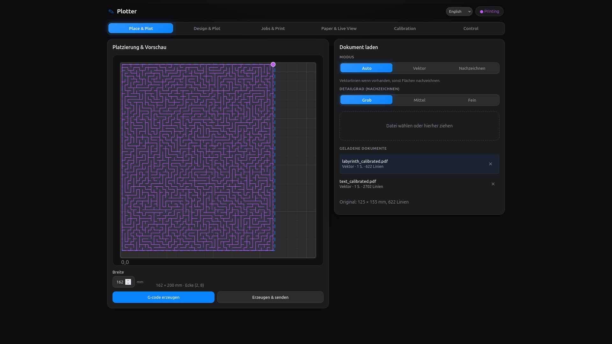
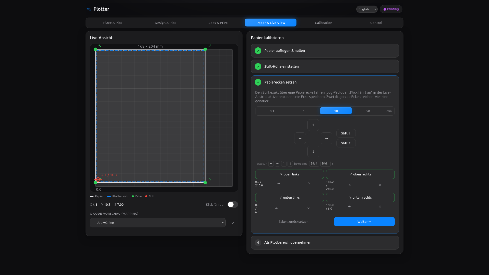

# Plotter

A browser-based pen plotter controller for turning PDF, SVG, image, and Office
documents into safe G-code for an **Anycubic i3 Mega S** or any OctoPrint-backed
printer.

<p align="center">
  
</p>

Plotter combines document conversion, visual layout, paper calibration, G-code
preview, job management, and printer control in one small web app. Upload a
document, place it on the virtual bed, calibrate the physical sheet, generate
G-code, preview the toolpaths, and send it to the printer — all from the same interface.

## Preview

<table>
  <tr>
    <td width="33%"></td>
    <td width="33%"></td>
    <td width="33%"></td>
  </tr>
  <tr>
    <td align="center"><strong>PDF rendering</strong></td>
    <td align="center"><strong>Design and plot</strong></td>
    <td align="center"><strong>Live calibration</strong></td>
  </tr>
</table>

## Features

- Convert PDF, SVG, raster images, and Office documents into plotter-ready
  G-code with [vpype](https://vpype.readthedocs.io).
- Place documents visually on a bed preview before generating G-code. Drag,
  scale, and fit artwork into the calibrated plot area.
- Trace image-only PDFs and scans with OpenCV while preserving vector paths
  from vector PDFs. Auto mode chooses the best conversion path automatically.
- Calibrate pen-up and pen-down Z heights, plot area, origin offsets, margins,
  and feedrates from the browser.
- Use the live paper calibration wizard to home the machine, jog to sheet
  corners, capture paper bounds, and map every conversion onto the real sheet.
- Preview generated G-code against the bed and calibrated paper before sending
  it to the printer.
- Track the head position from sent commands and persist it in Redis, with a
  file-store fallback for simple local setups.
- Enforce safety checks before saving or printing: generated jobs never contain
  `G28`, Z moves are limited to calibrated pen heights, and drawing moves must
  stay inside the configured plot area.
- Export calibration as XML and embed calibration metadata in every generated
  G-code job.
- Send, start, pause, cancel, home, jog, and lift/lower the pen through
  OctoPrint from the same UI.

## Run with Docker (recommended)

```bash
cp .env.example .env
# edit .env and set OCTOPRINT_URL / OCTOPRINT_API_KEY
docker compose up --build
```

Open <http://localhost:8000>. Calibration and generated jobs are persisted in
the `plotter-data` volume (`/data`).

> PDF support works out of the box (`poppler-utils` provides `pdftocairo`,
> `pdftoppm` and `pdfinfo`; OpenCV does the tracing). For Office documents,
> add `libreoffice-core` to the runtime stage in the `Dockerfile`.

## Local development

`make dev` starts Redis (Docker container `plotter-redis`), the backend with
reload and the Vite dev server in one go.

Backend only (FastAPI via uvicorn):

```bash
uv sync
OCTOPRINT_URL=... OCTOPRINT_API_KEY=... uv run plotter-web
```

Frontend (Vite dev server, proxies `/api` to the backend on :8000):

```bash
cd frontend
npm install
npm run dev
```

`npm run build` writes the production SPA into `plotter/web/static`, which the
backend serves automatically.

## Configuration

| Variable            | Purpose                             | Default   |
| ------------------- | ----------------------------------- | --------- |
| `OCTOPRINT_URL`     | Base URL of your OctoPrint instance | —         |
| `OCTOPRINT_API_KEY` | OctoPrint API key                   | —         |
| `OCTOPRINT_VERIFY_SSL` | Verify OctoPrint TLS certificates | `true`    |
| `PLOTTER_HOST_PORT` | Host port used by Docker Compose    | `8000`    |
| `PLOTTER_DATA_DIR`  | Where calibration + jobs are stored | `data`    |
| `PLOTTER_HOST`      | Bind host                           | `0.0.0.0` |
| `PLOTTER_PORT`      | Bind port                           | `8000`    |
| `REDIS_URL`         | Position cache (falls back to a file store under `<data>/state/` if unreachable) | `redis://localhost:6379/0` |

Calibration values (bed/plot size, origin, pen Z, feedrates) are edited in the
UI and stored in `<data>/calibration.json`. They are applied on every
conversion: the vpype G-code profile is generated on the fly, the drawing is
laid out into the plot area, Y is flipped into printer space and shifted by the
origin offset.

## CLI

The original command-line converter is still available:

```bash
uv run plotter input.pdf --output out/
uv run plotter input.svg --profile anycubic
```

## How the G-code is built

- PDF / Office input is rendered to SVG (`pdftocairo`, `soffice`).
- vpype reads the SVG, simplifies / merges / sorts lines, lays it out into the
  plot area and writes G-code with a generated `gwrite` profile.
- Pen up/down are absolute Z moves at the calibrated heights; travel and draw
  moves use the calibrated feedrates.
