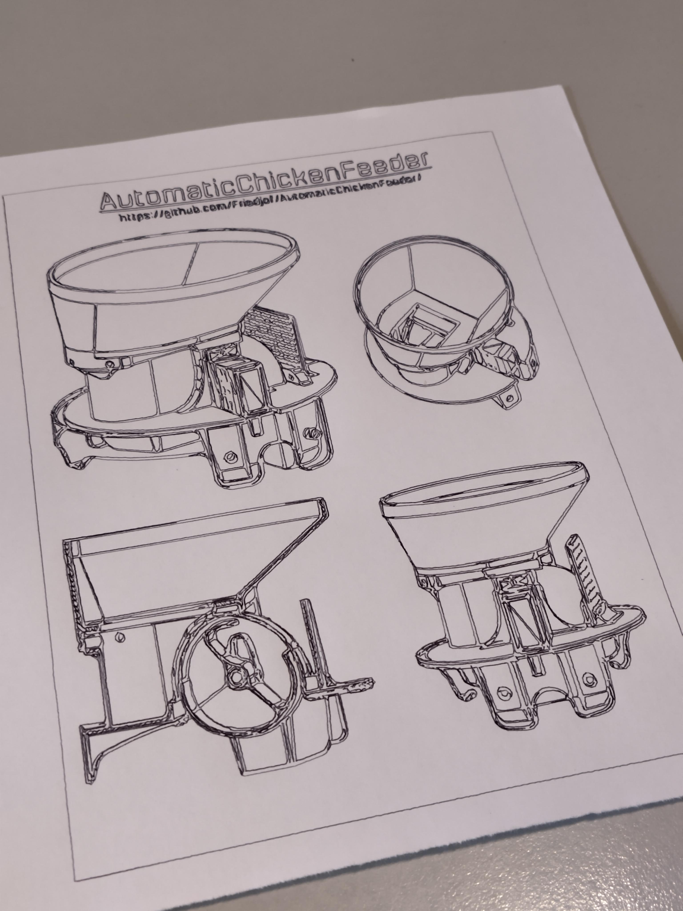
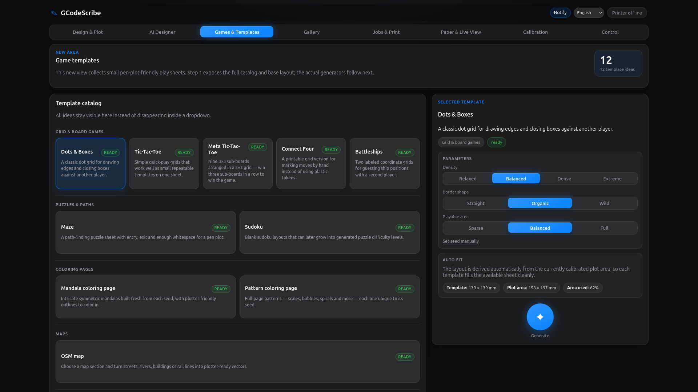
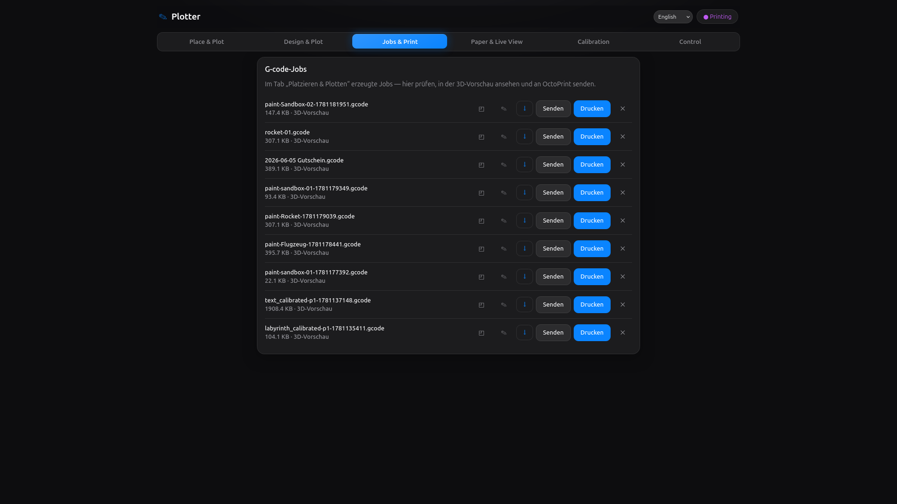
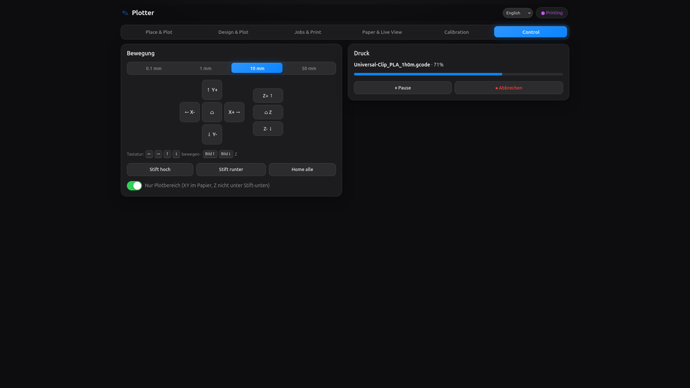

# GCodeScribe

A browser-based pen plotter controller for turning PDF, SVG, image, and Office
documents — or built-in generated artwork — into safe G-code for an
**Anycubic i3 Mega S** or any OctoPrint-backed printer.

<table>
  <tr>
    <td width="70%"></td>
    <td width="30%"></td>
  </tr>
</table>

GCodeScribe combines document conversion, built-in generators, a paint canvas,
visual layout, paper calibration, G-code preview, a design gallery, job
management, and printer control in one small web app. Bring in a document or
generate one, place it on the virtual bed, calibrate the physical sheet,
generate G-code, preview the toolpaths, and send it to the printer — all from
the same interface.

## Preview

<table>
  <tr>
    <td width="33%"></td>
    <td width="33%"></td>
    <td width="33%"></td>
  </tr>
  <tr>
    <td align="center"><strong>PDF rendering</strong></td>
    <td align="center"><strong>Design and plot</strong></td>
    <td align="center"><strong>Live calibration</strong></td>
  </tr>
  <tr>
    <td width="33%"></td>
    <td width="33%"></td>
    <td width="33%"></td>
  </tr>
  <tr>
    <td align="center"><strong>Generators &amp; games</strong></td>
    <td align="center"><strong>Plot jobs</strong></td>
    <td align="center"><strong>Printer control</strong></td>
  </tr>
</table>

## Features

### Convert documents

- Convert PDF, SVG, raster images, and Office documents into plotter-ready
  G-code with [vpype](https://vpype.readthedocs.io).
- Trace image-only PDFs and scans with OpenCV while preserving vector paths
  from vector PDFs. Auto mode chooses the best conversion path automatically.
- Place documents visually in the **Design &amp; Plot** tab: upload to the
  gallery, insert any page onto the bed preview, then drag, scale, and fit
  artwork into the calibrated plot area — or quick-plot a page in two clicks.

### Generate &amp; design

- Generate printable artwork directly in the browser — no source file needed:
  - **Puzzles:** mazes (classic, masked, hex, polar) and sudoku.
  - **Games:** dots &amp; boxes, tic-tac-toe, meta tic-tac-toe, connect four,
    battleships, bingo, and city/country/river sheets.
  - **Coloring pages:** mandalas and geometric pattern generators.
- Draw from scratch on the paint canvas: place shapes and text, scale and
  arrange them, and turn the result into a plot job.
- Keep every upload and generated design in the **gallery** — the one asset
  library for images, SVG, and multi-page PDF/Office documents (admin and public
  `/upload` submissions, filterable by origin) — with thumbnails, titles,
  archiving, and one-click reuse or insertion into the designer.

### Calibrate &amp; plot safely

- Calibrate pen-up and pen-down Z heights, plot area, origin offsets, margins,
  and feedrates from the browser.
- Use the live paper calibration wizard to home the machine, jog to sheet
  corners, capture paper bounds, and map every conversion onto the real sheet.
- Manage multiple calibration profiles (e.g. "A4 portrait", "postcard front
  left", "thick paper"): create, duplicate, activate, archive, and im-/export
  them as JSON — single profiles or a full bundle. Existing installations are
  migrated into a default profile automatically.
- Every generated job and paint page is bound to the profile it was created
  with (id + fingerprint over all safety-relevant values). The backend refuses
  to send a job whose profile does not exactly match the active one — foreign,
  changed (stale), archived, deleted, or pre-profile legacy jobs stay visible
  but are not printable until regenerated or explicitly adopted.
- Enforce safety checks before saving or printing: generated jobs never contain
  `G28`, Z moves are limited to calibrated pen heights, and drawing moves must
  stay inside the configured plot area.
- Export calibration as XML and embed calibration metadata in every generated
  G-code job.

### Preview &amp; control

- Preview generated G-code against the bed and calibrated paper before sending
  it to the printer.
- Track the head position from sent commands and persist it in Redis, with a
  file-store fallback for simple local setups.
- Send, start, pause, cancel, home, jog, and lift/lower the pen through
  OctoPrint from the same UI.

## Run with Docker (recommended)

```bash
cp .env.example .env
# edit .env and set OCTOPRINT_URL / OCTOPRINT_API_KEY
docker compose up --build
```

Open <http://localhost:8000>. Calibration and generated jobs are persisted in
the `gcodescribe-data` volume (`/data`).

On first opening the admin app, create the local admin account and enroll a
TOTP authenticator. The public `/upload` page stays available without login;
the normal app and API are protected by the admin session. Plain HTTP works for
local/LAN use, but passwords, TOTP codes and session cookies can be observed on
the network; use HTTPS if the controller is exposed beyond a trusted setup.

> PDF support works out of the box (`poppler-utils` provides `pdftocairo`,
> `pdftoppm` and `pdfinfo`; OpenCV does the tracing). For Office documents,
> add `libreoffice-core` to the runtime stage in the `Dockerfile`.

### Production

`compose.yml` ships the pre-built image released to GHCR rather than building
locally, with `PLOTTER_AUTH_COOKIE_SECURE` defaulting to `true` (terminate TLS
at a reverse proxy in front of the service):

```bash
cp .env.example .env   # set OCTOPRINT_URL / OCTOPRINT_API_KEY
docker compose -f compose.yml -f compose.prod.yml pull
docker compose -f compose.yml -f compose.prod.yml up -d
```

Pin a version with `GCODESCRIBE_TAG` (defaults to `latest`); images are tagged
`vX.Y.Z`, `X.Y` and `latest` by the release workflow. Both services run an
unprivileged user, declare health checks, cap their logs (10 MB × 3) and set
memory limits.

## Local development

`make dev` starts Redis (Docker container `gcodescribe-redis`), the backend with
reload and the Vite dev server in one go.

Backend only (FastAPI via uvicorn):

```bash
uv sync
OCTOPRINT_URL=... OCTOPRINT_API_KEY=... uv run gcodescribe-web
```

Frontend (Vite dev server, proxies `/api` to the backend on :8000):

```bash
cd frontend
npm install
npm run dev
```

`npm run build` writes the production SPA into `plotter/web/static`, which the
backend serves automatically.

## Configuration

| Variable            | Purpose                             | Default   |
| ------------------- | ----------------------------------- | --------- |
| `OCTOPRINT_URL`     | Base URL of your OctoPrint instance | —         |
| `OCTOPRINT_API_KEY` | OctoPrint API key                   | —         |
| `OCTOPRINT_VERIFY_SSL` | Verify OctoPrint TLS certificates | `true`    |
| `PLOTTER_HOST_PORT` | Host port used by Docker Compose    | `8000`    |
| `PLOTTER_DATA_DIR`  | Where calibration + jobs are stored | `data`    |
| `PLOTTER_HOST`      | Bind host                           | `0.0.0.0` |
| `PLOTTER_PORT`      | Bind port                           | `8000`    |
| `REDIS_URL`         | Position cache (falls back to a file store under `<data>/state/` if unreachable) | `redis://localhost:6379/0` |
| `PLOTTER_AUTH_SESSION_TTL` | Admin session lifetime in seconds | `1209600` |
| `PLOTTER_AUTH_COOKIE_SECURE` | Mark session cookie HTTPS-only | `false` |
| `GCODESCRIBE_TAG`   | GHCR image tag (prod compose only)  | `latest`  |

Calibration values (bed/plot size, origin, pen Z, feedrates) are edited in the
UI and stored as profiles under `<data>/profiles/` — one JSON file per profile
plus `active.json` for the selected one. `<data>/calibration.json` is kept as a
mirror of the active profile for backwards compatibility; on first start an
existing `calibration.json` is migrated into a default profile (with a one-time
`calibration.json.pre-profiles.bak` backup). The active calibration is applied
on every conversion: the vpype G-code profile is generated on the fly, the
drawing is laid out into the plot area, Y is flipped into printer space and
shifted by the origin offset.

Every generated job gets a JSON sidecar next to its `.gcode` file recording the
source and the profile (id, name, fingerprint) it was created with. Sending a
job to OctoPrint requires the sidecar profile to match the active profile
exactly; blocked attempts are logged with the reason.

## CLI

The original command-line converter is still available:

```bash
uv run gcodescribe input.pdf --output out/
uv run gcodescribe input.svg --profile anycubic
```

## How the G-code is built

- PDF / Office input is rendered to SVG (`pdftocairo`, `soffice`); generators
  and the paint canvas produce SVG directly.
- vpype reads the SVG, simplifies / merges / sorts lines, lays it out into the
  plot area and writes G-code with a generated `gwrite` profile.
- Pen up/down are absolute Z moves at the calibrated heights; travel and draw
  moves use the calibrated feedrates.
